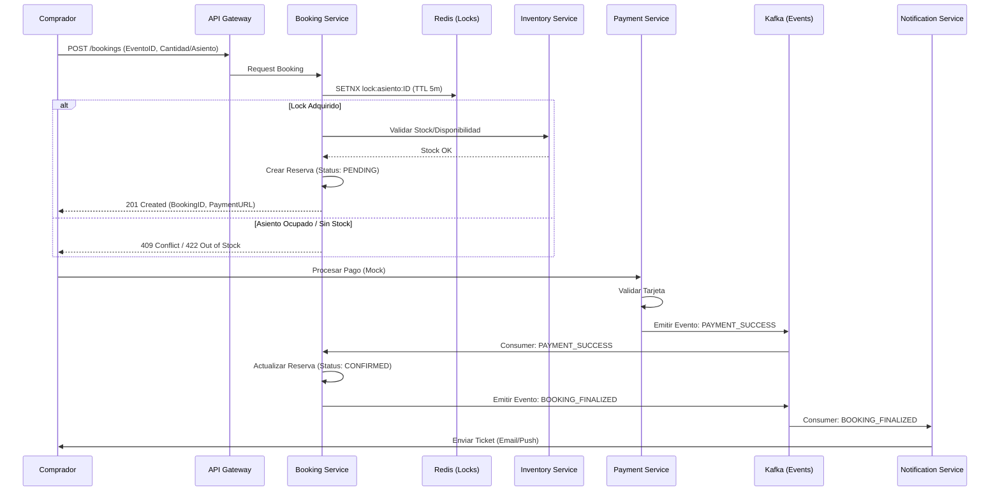
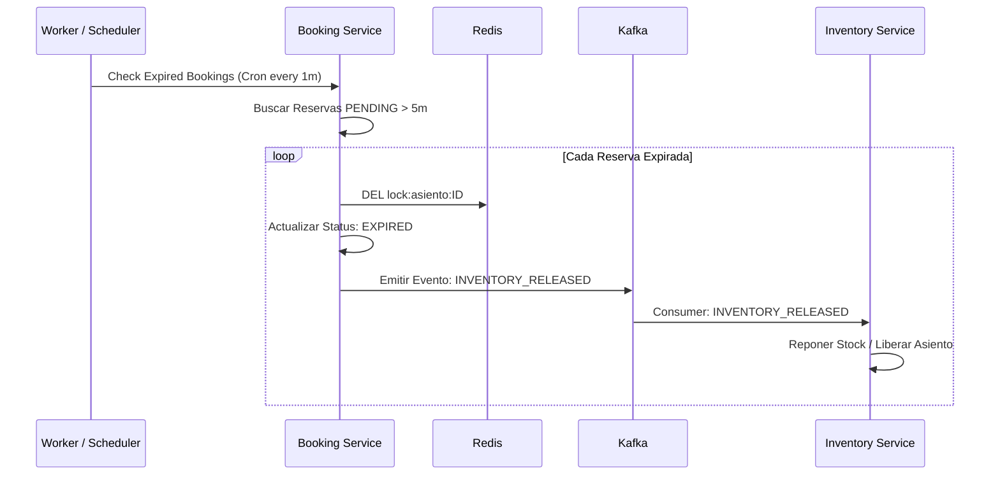
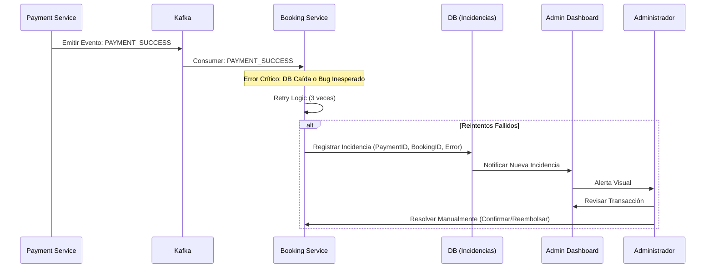

# Diagramas de Secuencia: OrionTicket

Este documento detalla los flujos de interacción entre los microservicios utilizando **Mermaid**. Estos diagramas son la base para la implementación de la consistencia eventual y el manejo de alta concurrencia.

---

## 1. Flujo Exitoso: Reserva y Pago (Happy Path)
Este flujo utiliza **Redis** para locks rápidos (concurrencia) y **Kafka** para la confirmación asíncrona.

---

## 2. Expiración de Reserva (TTL Cleanup)
Manejo de la liberación de inventario cuando el usuario no completa el pago en los 5 minutos establecidos.

---

## 3. Manejo de Inconsistencia (Falla Crítica Post-Cobro)
Este diagrama modela el requisito de "fila de espera manual" cuando el cobro es exitoso pero la confirmación del ticket falla.

