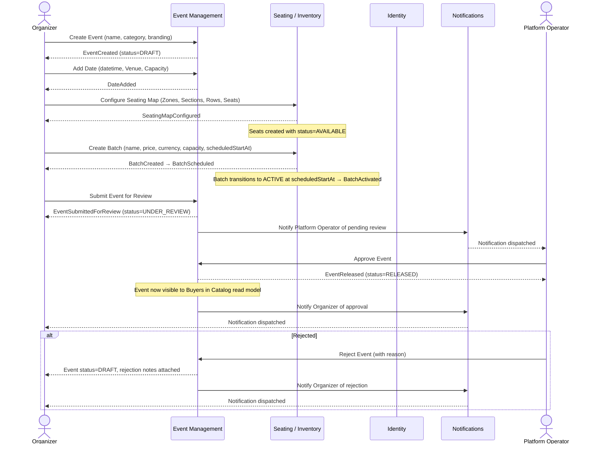
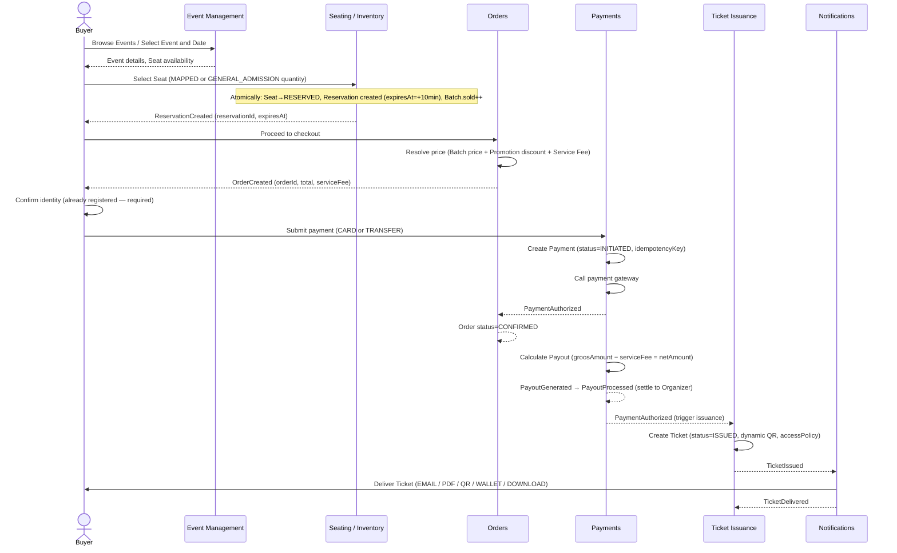
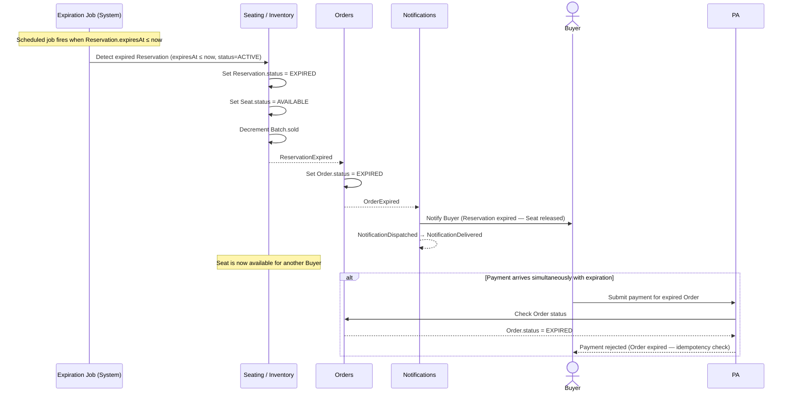
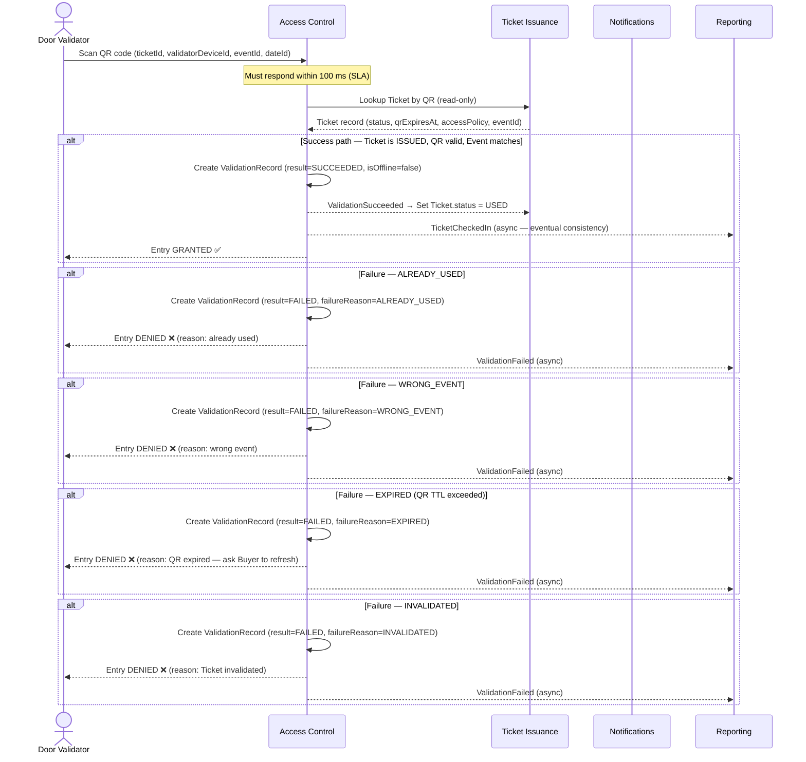
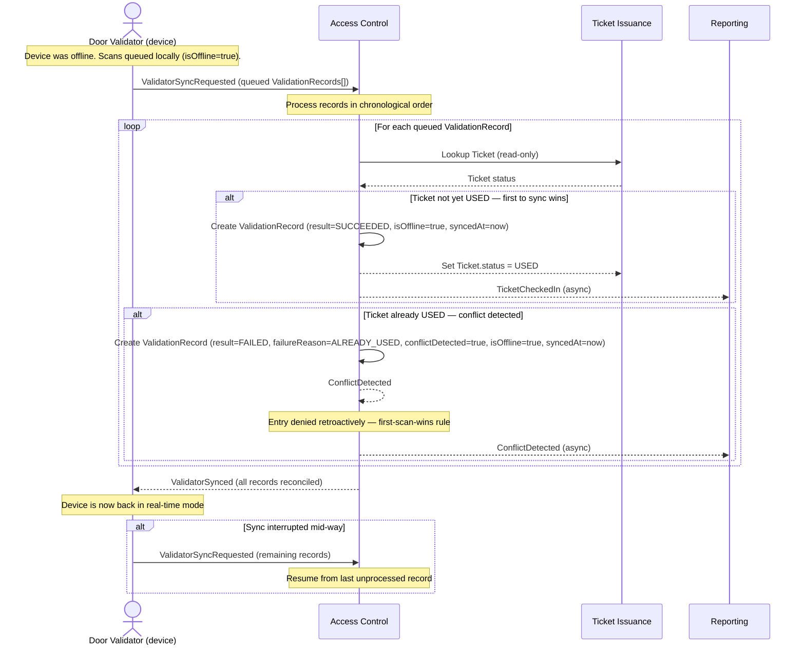

# Critical Flows

> **Phase:** 2 — Use Cases & Flows  
> **Source:** `docs/phases/phase-0/discovery.md` (Block 4.6, Block 5, Block 12.5), `docs/phases/phase-1/domain-events-map.md`, `docs/phases/phase-1/aggregate-definitions.md`  
> **Constraint:** Diagrams cover exactly the five flows specified in the Phase 2 prompt. Only ubiquitous language from `docs/phases/phase-1/ubiquitous-language-glossary.md` is used.

---

## Flow 1 — Organizer Creates and Submits Event for Review

Covers UC-EM-01, UC-EM-02, UC-EM-03, UC-SI-01, UC-EM-04.

---

## Flow 2 — Buyer Selects Seat, Reserves, Pays, Receives Ticket

Covers UC-SI-02, UC-OR-01, UC-PA-01, UC-TI-01, UC-NO-01.  
Source: discovery.md Block 4.6 checkout flow.

---

## Flow 3 — Reservation Expires Without Payment

Covers UC-SI-03.  
Source: discovery.md Block 4.4, Block 4.5.

---

## Flow 4 — Door Validator Scans QR — Success and Failure Paths

Covers UC-AC-01, UC-AC-02.  
Source: discovery.md Block 5.5, Block 8.4, Block 7.6.

---

## Flow 5 — Offline Validator Syncs After Reconnection

Covers UC-AC-03.  
Source: discovery.md Block 5.6, Block 12.5 flow 5.

