# Functional Requirements — Use Case Diagram

> **Phase:** 2 — Use Cases & Flows  
> **Source:** `docs/phases/phase-2/use-case-catalog.md`  
> **Notation:** UML Use Case Diagram rendered in Mermaid.  
> **Constraint:** Only actors and use cases defined in the Phase 2 use case catalog are represented here.

---

## Diagram

```mermaid
graph LR
    %% ─── Actors ───────────────────────────────────────────────────────────
    BY(["👤 Buyer"])
    OG(["👤 Organizer"])
    DV(["👤 Door Validator"])
    VS(["👤 Venue Staff"])
    SP(["👤 Support"])
    FN(["👤 Finance"])
    MK(["👤 Marketing"])
    PO(["👤 Platform Operator"])
    SA(["👤 Super Admin"])
    SYS(["⚙️ System"])

    %% ─── Identity ─────────────────────────────────────────────────────────
    subgraph ID["Identity"]
        UC_ID01["UC-ID-01\nBuyer Self-Registration"]
        UC_ID02["UC-ID-02\nOrganizer Staff Management"]
        UC_ID03["UC-ID-03\nUser & Role Management"]
    end

    %% ─── Event Management ──────────────────────────────────────────────────
    subgraph EM["Event Management"]
        UC_EM01["UC-EM-01\nCreate Event with Dates"]
        UC_EM02["UC-EM-02\nConfigure Seating Map"]
        UC_EM03["UC-EM-03\nSubmit Event for Review"]
        UC_EM04["UC-EM-04\nApprove / Reject Event"]
        UC_EM05["UC-EM-05\nCancel Event"]
    end

    %% ─── Seating / Inventory ───────────────────────────────────────────────
    subgraph SI["Seating / Inventory"]
        UC_SI01["UC-SI-01\nCreate Batch"]
        UC_SI02["UC-SI-02\nSelect Seat & Create Reservation"]
        UC_SI03["UC-SI-03\nReservation Expires Without Payment"]
    end

    %% ─── Orders ────────────────────────────────────────────────────────────
    subgraph OR["Orders"]
        UC_OR01["UC-OR-01\nInitiate Checkout (Order Creation)"]
        UC_OR02["UC-OR-02\nOverride Reservation"]
    end

    %% ─── Payments ──────────────────────────────────────────────────────────
    subgraph PA["Payments"]
        UC_PA01["UC-PA-01\nComplete Payment"]
        UC_PA02["UC-PA-02\nPayment Fails"]
        UC_PA03["UC-PA-03\nGenerate Payout for Organizer"]
    end

    %% ─── Ticket Issuance ───────────────────────────────────────────────────
    subgraph TI["Ticket Issuance"]
        UC_TI01["UC-TI-01\nIssue Ticket After Payment"]
        UC_TI02["UC-TI-02\nCancel Ticket"]
        UC_TI03["UC-TI-03\nResend Ticket Manually"]
        UC_TI04["UC-TI-04\nInvalidate Ticket"]
    end

    %% ─── Access Control ────────────────────────────────────────────────────
    subgraph AC["Access Control"]
        UC_AC01["UC-AC-01\nScan QR — Success"]
        UC_AC02["UC-AC-02\nScan QR — Failure"]
        UC_AC03["UC-AC-03\nOffline Validator Sync"]
    end

    %% ─── Notifications ─────────────────────────────────────────────────────
    subgraph NO["Notifications"]
        UC_NO01["UC-NO-01\nDispatch Event-Driven Notification"]
    end

    %% ─── Reporting ─────────────────────────────────────────────────────────
    subgraph RE["Reporting"]
        UC_RE01["UC-RE-01\nView Financial Reports"]
        UC_RE02["UC-RE-02\nView Own Sales Reports"]
        UC_RE03["UC-RE-03\nView Access Reports"]
    end

    %% ─── Actor → Use Case associations ────────────────────────────────────

    %% Buyer
    BY --- UC_ID01
    BY --- UC_SI02
    BY --- UC_OR01
    BY --- UC_PA01

    %% Organizer
    OG --- UC_ID02
    OG --- UC_EM01
    OG --- UC_EM02
    OG --- UC_EM03
    OG --- UC_EM05
    OG --- UC_SI01
    OG --- UC_TI02
    OG --- UC_RE02

    %% Door Validator
    DV --- UC_AC01
    DV --- UC_AC02
    DV --- UC_AC03

    %% Venue Staff
    VS --- UC_RE03

    %% Support
    SP --- UC_TI03

    %% Finance
    FN --- UC_RE01

    %% Marketing
    MK --- UC_RE02

    %% Platform Operator
    PO --- UC_EM04
    PO --- UC_OR02
    PO --- UC_RE01

    %% Super Admin
    SA --- UC_ID03
    SA --- UC_EM04
    SA --- UC_EM05
    SA --- UC_TI02
    SA --- UC_RE01

    %% System (automated / event-driven)
    SYS --- UC_SI03
    SYS --- UC_PA02
    SYS --- UC_PA03
    SYS --- UC_TI01
    SYS --- UC_TI04
    SYS --- UC_NO01
```

---

## Actor summary

| Actor | Use Cases |
|---|---|
| **Buyer** | UC-ID-01, UC-SI-02, UC-OR-01, UC-PA-01 |
| **Organizer** | UC-ID-02, UC-EM-01, UC-EM-02, UC-EM-03, UC-EM-05, UC-SI-01, UC-TI-02, UC-RE-02 |
| **Door Validator** | UC-AC-01, UC-AC-02, UC-AC-03 |
| **Venue Staff** | UC-RE-03 |
| **Support** | UC-TI-03 |
| **Finance** | UC-RE-01 |
| **Marketing** | UC-RE-02 |
| **Platform Operator** | UC-EM-04, UC-OR-02, UC-RE-01 |
| **Super Admin** | UC-ID-03, UC-EM-04, UC-EM-05, UC-TI-02, UC-RE-01 |
| **System** | UC-SI-03, UC-PA-02, UC-PA-03, UC-TI-01, UC-TI-04, UC-NO-01 |
