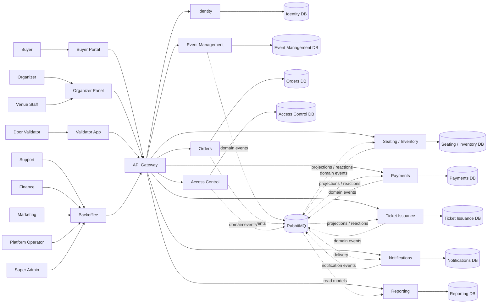
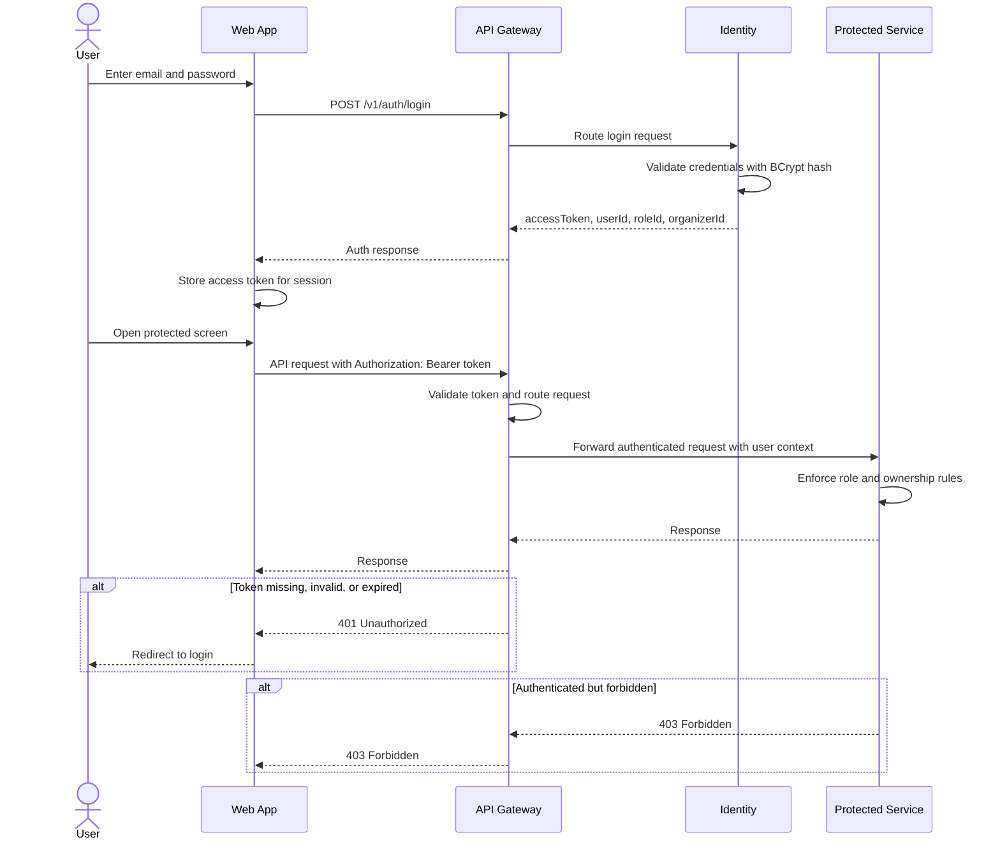
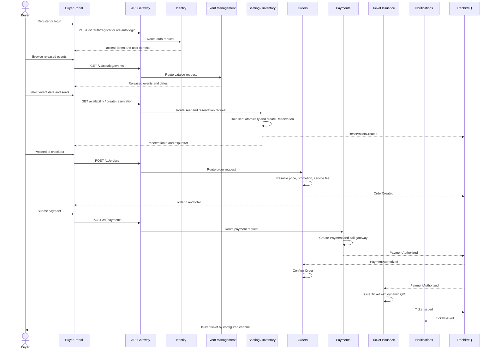
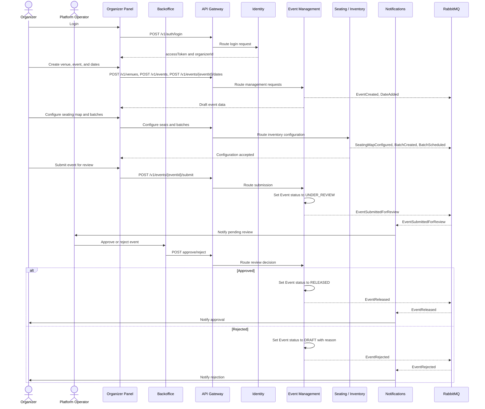
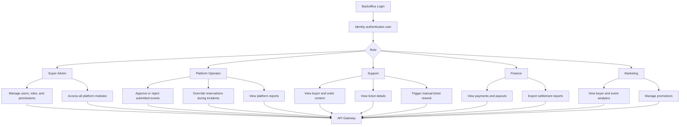
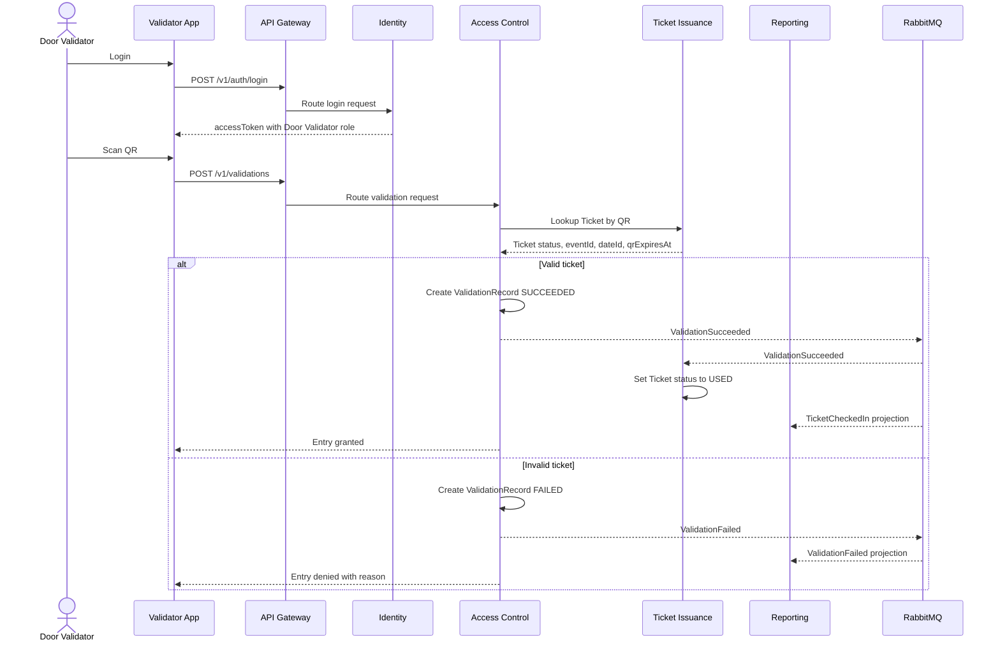
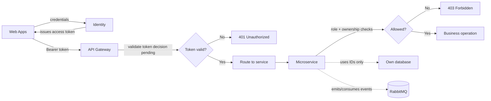

# System Flow Diagrams

> **Phase:** 2 — Use Cases & Flows  
> **Purpose:** Complement `critical-flows.md` with end-to-end system diagrams that include frontend entry points, login, API Gateway routing, actors, and service collaboration.  
> **Security note:** These diagrams treat the access token as the logical authentication contract. The implementation detail for token validation (shared JWT secret vs. asymmetric JWKS/OAuth2 Resource Server) is pending a security decision.

---

## Actors and Entry Points

---

## Login and Authenticated Request

This diagram describes the required logical flow for all web applications. It does not decide whether JWT validation is implemented with a shared secret or JWKS.

---

## Buyer Purchase Journey

---

## Organizer Event Publication Journey

---

## Backoffice Journeys

---

## Door Validation Journey

---

## Security Responsibility Boundary

### Pending Security Decision

The diagrams above require one concrete implementation decision before production hardening:

- Shared-secret JWT validation across Gateway and services.
- Asymmetric JWT validation through JWKS / OAuth2 Resource Server.

The API Gateway ADR requires JWT validation at the gateway without per-request calls to Identity. Microservices still need enough authenticated user context to enforce role and ownership rules.
