# Deployment Diagram

> **Phase:** 3 — Architecture  
> **Source:** `docs/phases/phase-0/discovery.md` Block 10, Block 11; `docs/phases/phase-1/bounded-context-diagrams.md`

---

## Technology decisions

| Component | Technology | Status |
|---|---|---|
| Container orchestration | **STATUS: PENDING** — Options: Kubernetes (EKS/GKE/AKS), Docker Swarm, ECS Fargate. Criteria: team expertise, cost at $50K budget, operational complexity, auto-scaling support. | PENDING |
| Message broker | **STATUS: PENDING** — Options: RabbitMQ, Apache Kafka, AWS SQS/SNS, Google Pub/Sub. Criteria: ordering guarantees, dead-letter handling, throughput at 1K txn/min peak, team familiarity, operational cost. | PENDING |
| API gateway | **STATUS: PENDING** — Options: Kong, AWS API Gateway, Traefik, Envoy. Criteria: rate limiting, authentication passthrough, WebSocket support for validator, cost, ease of configuration. | PENDING |
| Cloud provider | **STATUS: PENDING** — Options: AWS, GCP, Azure. Criteria: Guatemala latency, managed services availability, cost within $50K budget, payment gateway compatibility. | PENDING |
| Observability stack | OpenTelemetry (traces + metrics), structured JSON logs | Decided (discovery.md Block 11.8) |
| Database per service | Each service owns its database exclusively | Decided (discovery.md Block 11.2) |

---

## Diagram

```mermaid
graph TB
    %% ─── Clients ────────────────────────────────────────────────────────
    subgraph Clients["Client-Facing Frontends"]
        BP["Buyer Portal\n(Responsive Web)"]
        OP["Organizer Panel\n(Scoped to own data)"]
        SAP["Super Admin Panel\n(Full platform visibility)"]
        VA["Validator App\n(Mobile/Tablet — offline capable)"]
    end

    %% ─── API Gateway ────────────────────────────────────────────────────
    GW["API Gateway\nSTATUS: PENDING\nRate limiting · Auth · Routing"]

    BP --> GW
    OP --> GW
    SAP --> GW
    VA --> GW

    %% ─── Core Business Services ─────────────────────────────────────────
    subgraph CoreServices["Core Business Services"]
        ID_SVC["Identity Service\nUsers · Roles · Auth · Sessions"]
        EM_SVC["Event Management Service\nEvents · Dates · Venues\nCatalog read model"]
        SI_SVC["Seating / Inventory Service\nSeats · Reservations · Batches\nCapacity · Availability"]
        OR_SVC["Orders Service\nCheckout · Price resolution\nPromotions · Service Fee"]
        PA_SVC["Payments Service\nGateway integration\nService Fee · Payouts"]
        TI_SVC["Ticket Issuance Service\nQR generation · Delivery\nPost-issuance state"]
        AC_SVC["Access Control Service\nValidation · Offline sync\nConflict resolution"]
    end

    %% ─── Cross-cutting Services ─────────────────────────────────────────
    subgraph CrossCutting["Cross-cutting Services"]
        NO_SVC["Notifications Service\nEmail · SMS · WhatsApp"]
        RE_SVC["Reporting Service\nSales · Commission · Access\nRead models / projections"]
    end

    %% ─── Cross-cutting Infrastructure ───────────────────────────────────
    subgraph Infrastructure["Cross-cutting Infrastructure"]
        MB["Message Broker\nSTATUS: PENDING\nAsync domain events"]
        AL["AuditLog Store\nAppend-only · Centralized\nWritten by all services"]
        OBS["Observability Stack\nOpenTelemetry · Structured Logs\nMetrics · Alerting · Dashboard"]
    end

    %% ─── Databases (one per service) ────────────────────────────────────
    subgraph Databases["Databases (one per service)"]
        DB_ID[("Identity DB")]
        DB_EM[("Event Mgt DB")]
        DB_SI[("Seating/Inv DB")]
        DB_OR[("Orders DB")]
        DB_PA[("Payments DB")]
        DB_TI[("Ticket Issuance DB")]
        DB_AC[("Access Control DB")]
        DB_NO[("Notifications DB")]
        DB_RE[("Reporting DB")]
    end

    %% ─── External Systems ───────────────────────────────────────────────
    subgraph External["External Integrations"]
        PGW["Payment Gateway\n(Cards + Transfers — Guatemala)"]
        EMAIL["Email Provider"]
        SMS["SMS / WhatsApp Provider"]
        ANALYTICS["Analytics Platform"]
    end

    %% ─── Gateway → Services (synchronous) ───────────────────────────────
    GW --> ID_SVC
    GW --> EM_SVC
    GW --> SI_SVC
    GW --> OR_SVC
    GW --> PA_SVC
    GW --> TI_SVC
    GW --> AC_SVC
    GW --> NO_SVC
    GW --> RE_SVC

    %% ─── Service → own DB ───────────────────────────────────────────────
    ID_SVC --> DB_ID
    EM_SVC --> DB_EM
    SI_SVC --> DB_SI
    OR_SVC --> DB_OR
    PA_SVC --> DB_PA
    TI_SVC --> DB_TI
    AC_SVC --> DB_AC
    NO_SVC --> DB_NO
    RE_SVC --> DB_RE

    %% ─── Synchronous inter-service calls ────────────────────────────────
    SI_SVC -- "Seat hold (sync, strong consistency)" --> SI_SVC
    AC_SVC -- "QR lookup (sync, 100ms SLA)" --> TI_SVC
    PA_SVC -- "Gateway webhook → Order status (sync)" --> OR_SVC

    %% ─── Async events via Message Broker ────────────────────────────────
    SI_SVC -- "ReservationCreated\nReservationExpired\nBatchActivated" --> MB
    OR_SVC -- "OrderCreated\nOrderExpired" --> MB
    PA_SVC -- "PaymentAuthorized\nPaymentFailed\nPayoutGenerated" --> MB
    TI_SVC -- "TicketIssued\nTicketCanceled\nTicketInvalidated" --> MB
    AC_SVC -- "ValidationSucceeded\nConflictDetected\nValidatorSynced" --> MB
    EM_SVC -- "EventReleased\nEventCanceled" --> MB

    MB --> NO_SVC
    MB --> RE_SVC
    MB --> TI_SVC
    MB --> SI_SVC
    MB --> OR_SVC

    %% ─── External integrations ──────────────────────────────────────────
    PA_SVC --> PGW
    NO_SVC --> EMAIL
    NO_SVC --> SMS
    RE_SVC --> ANALYTICS

    %% ─── Cross-cutting writes ───────────────────────────────────────────
    ID_SVC -.-> AL
    EM_SVC -.-> AL
    SI_SVC -.-> AL
    OR_SVC -.-> AL
    PA_SVC -.-> AL
    TI_SVC -.-> AL
    AC_SVC -.-> AL
    NO_SVC -.-> AL
    RE_SVC -.-> AL

    ID_SVC -.-> OBS
    EM_SVC -.-> OBS
    SI_SVC -.-> OBS
    OR_SVC -.-> OBS
    PA_SVC -.-> OBS
    TI_SVC -.-> OBS
    AC_SVC -.-> OBS
    NO_SVC -.-> OBS
    RE_SVC -.-> OBS
```

---

## Notes

1. **Solid arrows** represent synchronous request/response calls or data ownership writes.
2. **Labeled arrows to Message Broker** represent asynchronous domain event publishing.
3. **Dotted arrows** represent cross-cutting infrastructure writes (AuditLog, Observability) — non-blocking.
4. **Validator App** connects through the API Gateway but must function offline; local state with sync-on-reconnect pattern as documented in ADR-007.
5. All **STATUS: PENDING** components require ADR resolution (see `docs/phases/phase-3/adrs/`) before infrastructure provisioning begins.
