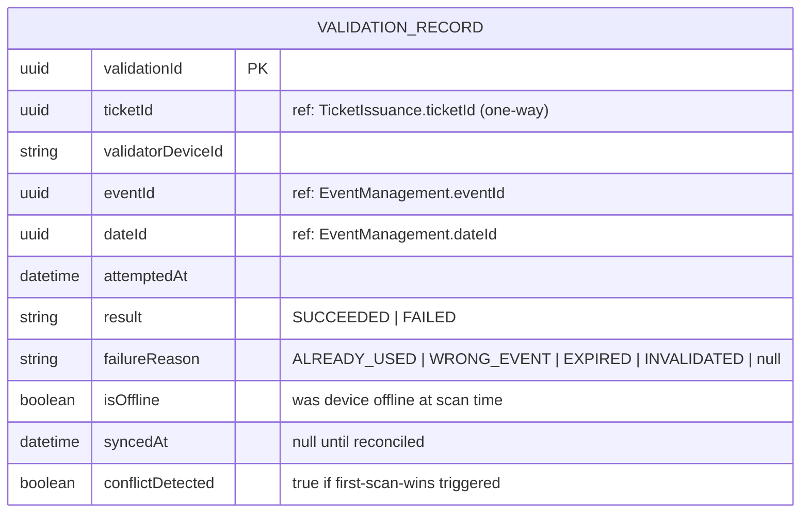

# ER Diagram — Access Control

> **Bounded Context:** Access Control  
> **Owned by:** Access Control Service  
> **Source:** `docs/phases/phase-1/aggregate-definitions.md`

> **Cross-service references:** `ticketId` → Ticket Issuance (one-way, read-only — ADR-013). `eventId`, `dateId` → Event Management. All by ID only. ValidationRecord is immutable — append-only, never modified after creation.
