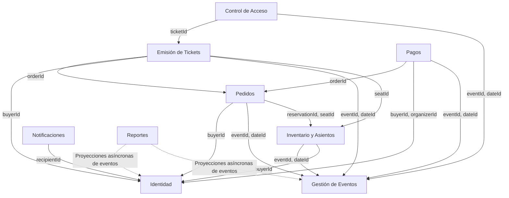
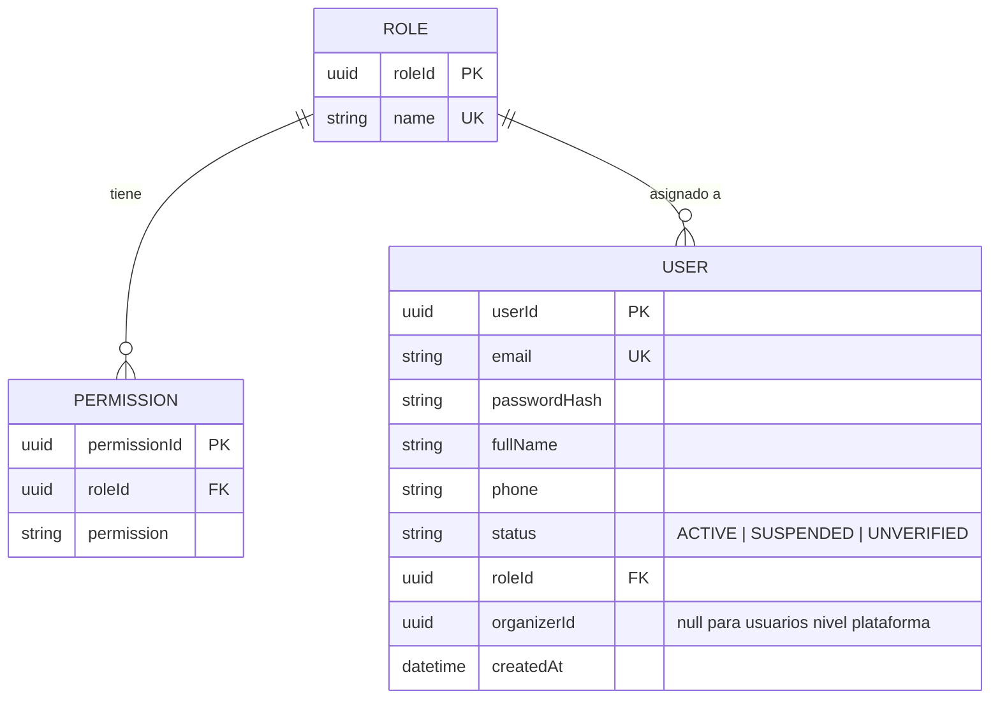
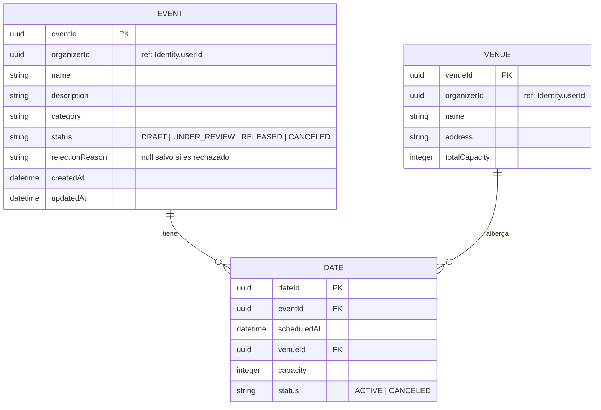
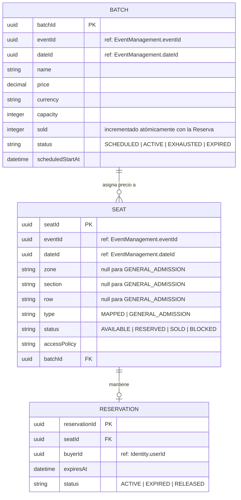
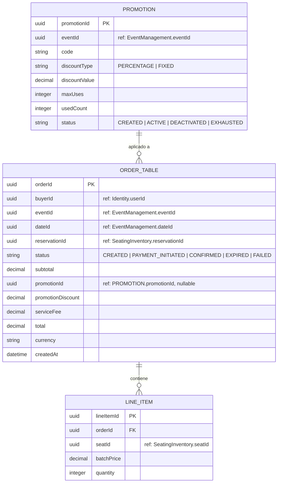
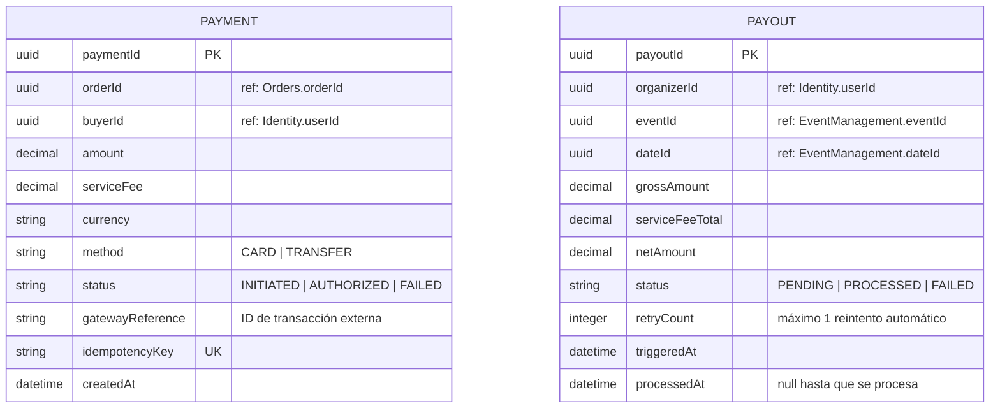
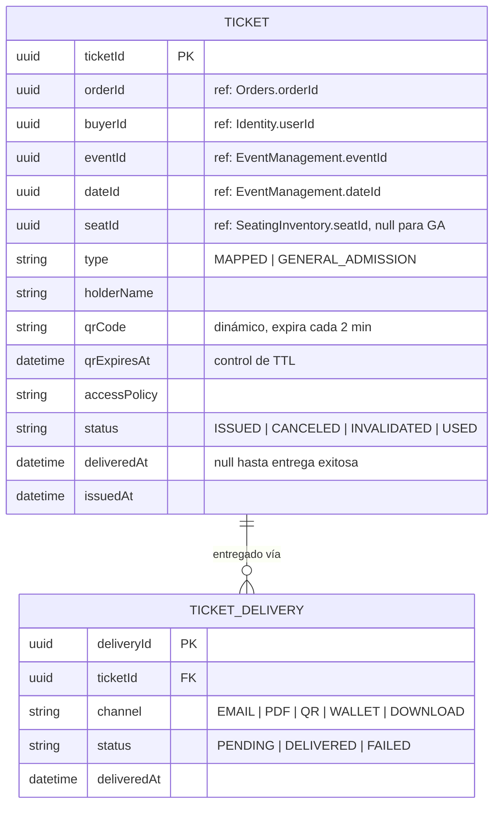
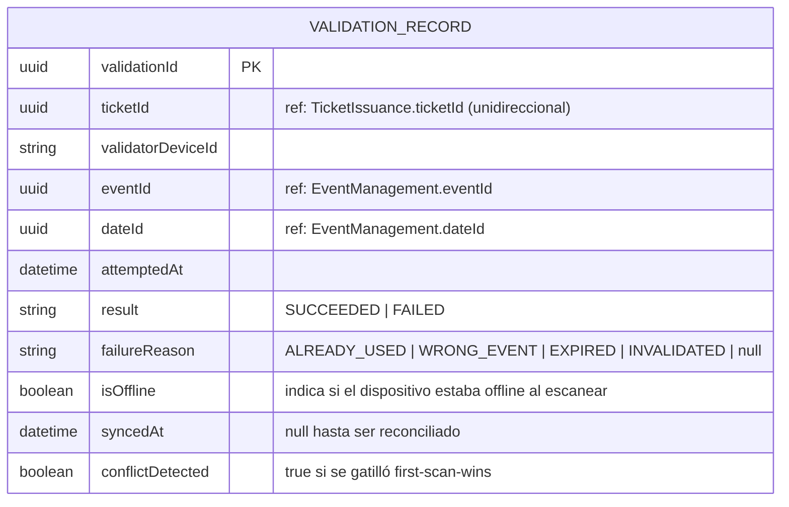
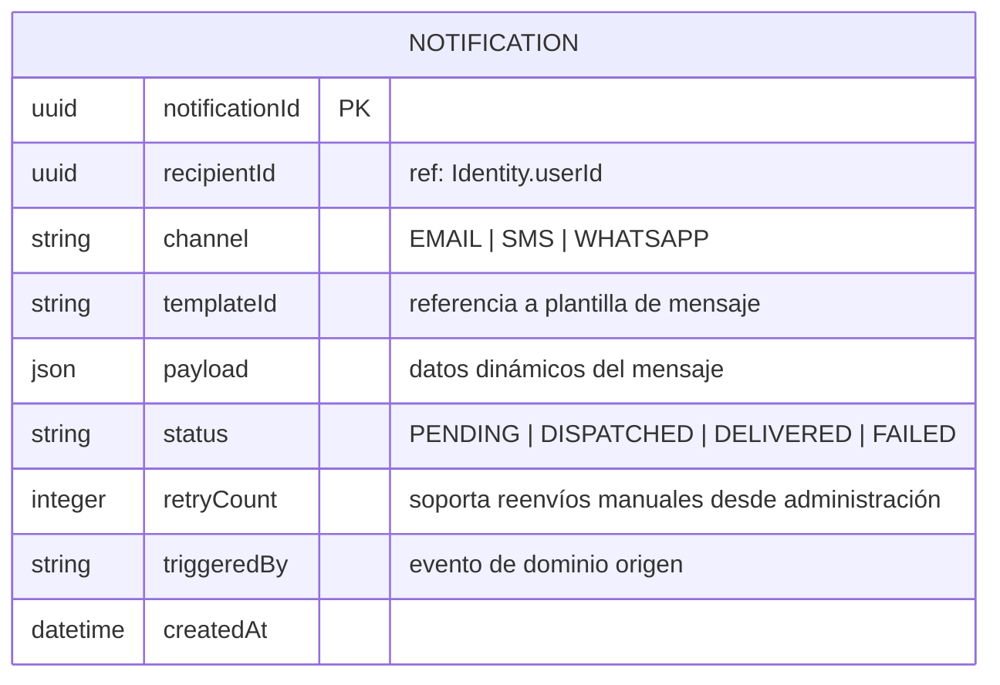
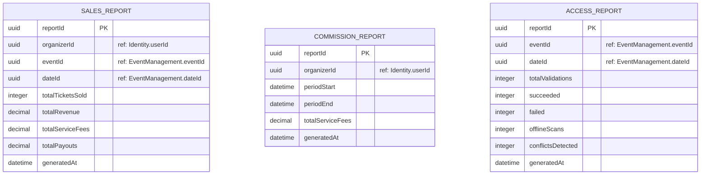

# Esquema de Diagramas ER Consolidado — OrionTicket

Este documento consolida y unifica el modelo de datos de todos los microservicios de OrionTicket.

## 📌 Principios de Arquitectura de Datos

De acuerdo con el **ADR-001 (Arquitectura de Microservicios)**, el **ADR-008 (Base de Datos Compartida y Multi-Esquema para Desarrollo/MVP)** y los estándares del proyecto:
1. **Aislamiento de Datos por Servicio**: Cada microservicio tiene la propiedad exclusiva de sus datos. No existen llaves foráneas (`FK`) a nivel de base de datos entre tablas de diferentes microservicios.
2. **Referencias Cruzadas por ID**: Las relaciones entre microservicios se realizan únicamente mediante identificadores (`UUID`) lógicos.
3. **Eventos de Dominio y Consistencia Eventual**: La propagación de estados y la actualización de modelos de lectura (como el servicio de Reportes) se realiza de forma asíncrona consumiendo eventos de RabbitMQ.
4. **Modelos Colapsados**: 
   - El catálogo de lectura está colapsado dentro de **Event Management** (`ADR-010`).
   - La resolución de precios y promociones está colapsada dentro de **Orders** (`ADR-011`).

---

## 🗺️ Mapa General de Referencias entre Servicios

---

## 1. Identidad (Identity)
* **Contexto Delimitado**: Identity
* **Propietario**: Identity Service
* **Propósito**: Gestiona usuarios, roles y permisos de la plataforma.

### Descripción de Entidades
* **USER (Usuario)**: Información principal del usuario.
  * `status`: Define si la cuenta está activa, suspendida o sin verificar.
  * `organizerId`: Se refiere al ID del propio usuario si actúa como Organizador.
* **ROLE (Rol)**: Roles del sistema (ej. CLIENTE, ORGANIZADOR, ADMIN).
* **PERMISSION (Permiso)**: Permisos granulares asociados a cada rol.

---

## 2. Gestión de Eventos (Event Management)
* **Contexto Delimitado**: Event Management
* **Propietario**: Event Management Service
* **Propósito**: Gestiona los eventos, las fechas y los recintos de presentación. El catálogo de consulta rápida está colapsado dentro de este servicio (`ADR-010`).

### Descripción de Entidades
* **EVENT (Evento)**: Información general del espectáculo musical o deportivo.
* **DATE (Fecha)**: Instancia de programación temporal de un evento en un recinto específico.
* **VENUE (Recinto/Estadio)**: El lugar físico donde se lleva a cabo el evento.

---

## 3. Asientos e Inventario (Seating / Inventory)
* **Contexto Delimitado**: Seating / Inventory
* **Propietario**: Seating/Inventory Service
* **Propósito**: Control estricto de disponibilidad física y lógica de asientos, zonas y lotes. Bloqueos temporales para evitar sobreventa (Overbooking - Tolerancia Cero).

### Descripción de Entidades
* **SEAT (Asiento)**: Representa el inventario de la sala o estadio. Puede ser numerado (`MAPPED`) o de admisión general (`GENERAL_ADMISSION`).
* **RESERVATION (Reserva Temporal)**: Bloqueo de un asiento durante la compra por un tiempo determinado (`expiresAt`).
* **BATCH (Lote de Venta/Fase)**: Define las etapas de precios de las entradas (ej. Preventa, Fase 1, Fase 2) con capacidades limitadas.

---

## 4. Pedidos (Orders)
* **Contexto Delimitado**: Orders
* **Propietario**: Orders Service
* **Propósito**: Registro de transacciones de compra, aplicación de promociones y desglose financiero.

### Descripción de Entidades
* **ORDER_TABLE (Pedido)**: Cabecera del pedido de compra.
* **LINE_ITEM (Detalle del Pedido)**: Desglose por asiento comprado y precio de lote aplicado.
* **PROMOTION (Promoción / Código de Descuento)**: Campañas de descuentos aplicables a eventos.

---

## 5. Pagos (Payments)
* **Contexto Delimitado**: Payments
* **Propietario**: Payments Service
* **Propósito**: Procesamiento de pagos con pasarelas externas y liquidación diferida de fondos a organizadores.

### Descripción de Entidades
* **PAYMENT (Pago)**: Registro de los intentos de cobro a compradores. Exige `idempotencyKey` para evitar cargos dobles.
* **PAYOUT (Liquidación / Pago a Organizador)**: Desembolso al organizador. Se calcula asíncronamente una vez que finaliza la fecha del evento (`ADR-009`).

---

## 6. Emisión de Tickets (Ticket Issuance)
* **Contexto Delimitado**: Ticket Issuance
* **Propietario**: Ticket Issuance Service
* **Propósito**: Generación del boleto digital final, incluyendo códigos QR dinámicos con tiempo de vida (TTL) rotativo (`ADR-006`).

### Descripción de Entidades
* **TICKET (Boleto/Ticket)**: Activo digital que acredita el derecho de entrada. El código QR cambia periódicamente para evitar reventa o duplicación ilegal.
* **TICKET_DELIVERY (Entrega del Boleto)**: Seguimiento multicanal del proceso de envío del boleto.

---

## 7. Control de Acceso (Access Control)
* **Contexto Delimitado**: Access Control
* **Propietario**: Access Control Service
* **Propósito**: Registro en tiempo real de los escaneos de entradas en puertas de acceso. Soporta validación offline y conciliación asíncrona mediante el principio de "El Primer Escaneo Gana" (*First-Scan-Wins*, `ADR-007`).

### Descripción de Entidades
* **VALIDATION_RECORD (Registro de Validación)**: Tabla inmutable (append-only) que registra cada intento de lectura del QR en los accesos físicos.
  * `isOffline`: Soporta el almacenamiento local temporal en dispositivos portátiles.
  * `conflictDetected`: Activa flujos de auditoría si se detecta duplicidad del mismo ticket tras una sincronización posterior.

---

## 8. Notificaciones (Notifications)
* **Contexto Delimitado**: Notifications
* **Propietario**: Notifications Service
* **Propósito**: Envío de correos electrónicos, SMS o alertas de WhatsApp basadas en eventos de dominio del sistema.

---

## 9. Reportes (Reporting)
* **Contexto Delimitado**: Reporting
* **Propietario**: Reporting Service
* **Propósito**: Generación de reportes analíticos y financieros mediante proyecciones de lectura asíncronas basadas en eventos. **Nunca realiza consultas directas a otras bases de datos.**

### Descripción de Entidades
* **SALES_REPORT (Reporte de Ventas)**: Agrega métricas financieras para los organizadores de un evento en una fecha específica.
* **COMMISSION_REPORT (Reporte de Comisiones)**: Resume las tarifas de servicio de la plataforma recaudadas durante un período de tiempo para la administración.
* **ACCESS_REPORT (Reporte de Accesos)**: Consolida el flujo de ingresos al recinto, porcentaje de fallas de QR, lecturas offline y conflictos detectados.
