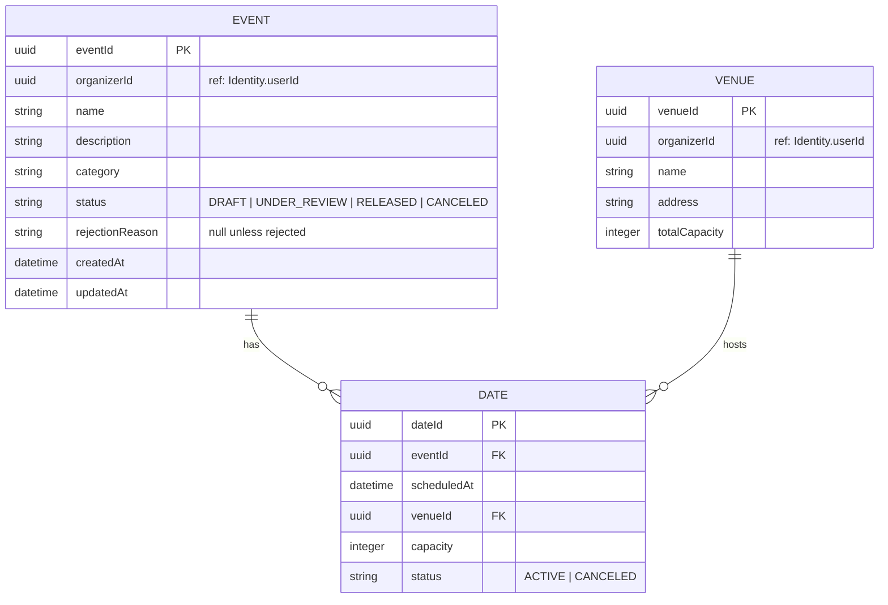

# ER Diagram — Event Management

> **Bounded Context:** Event Management  
> **Owned by:** Event Management Service  
> **Source:** `docs/phases/phase-1/aggregate-definitions.md`  
> **Note:** Catalog is a read model inside this context (ADR-010).

> **Cross-service references:** `organizerId` references `Identity.userId` by ID only. Seating/Inventory uses `eventId` and `dateId` by ID only.
