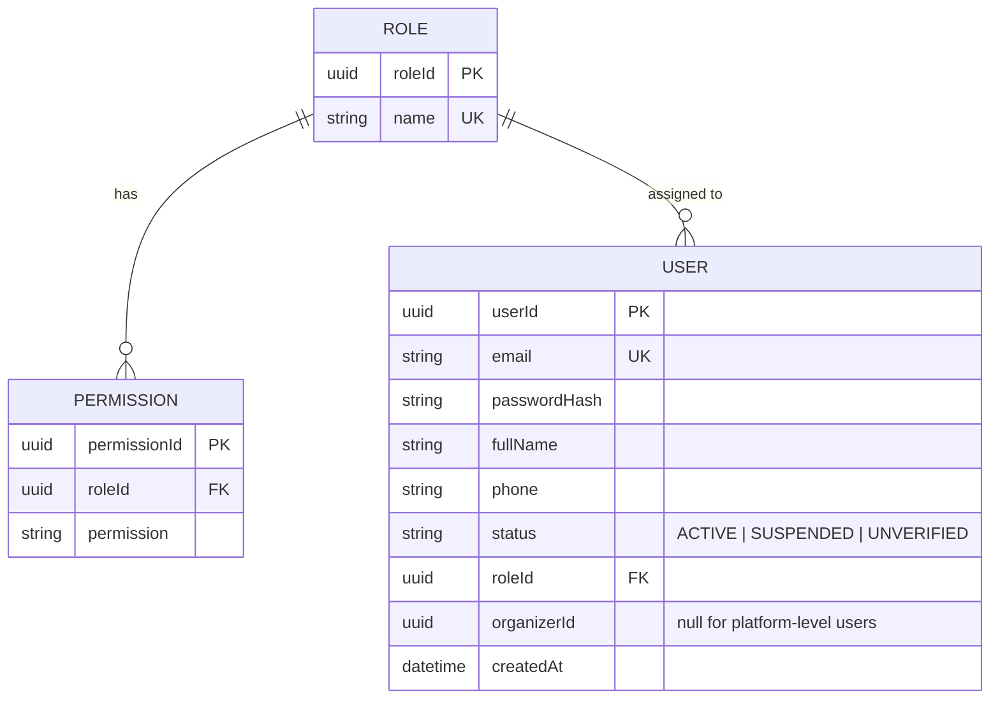

# ER Diagram — Identity

> **Bounded Context:** Identity  
> **Owned by:** Identity Service  
> **Source:** `docs/phases/phase-1/aggregate-definitions.md`

> **Cross-service references:** `organizerId` references an Organizer managed within Identity (organizerId = userId of an Organizer-role User). Other services reference `userId` by ID only — no foreign keys across boundaries.
