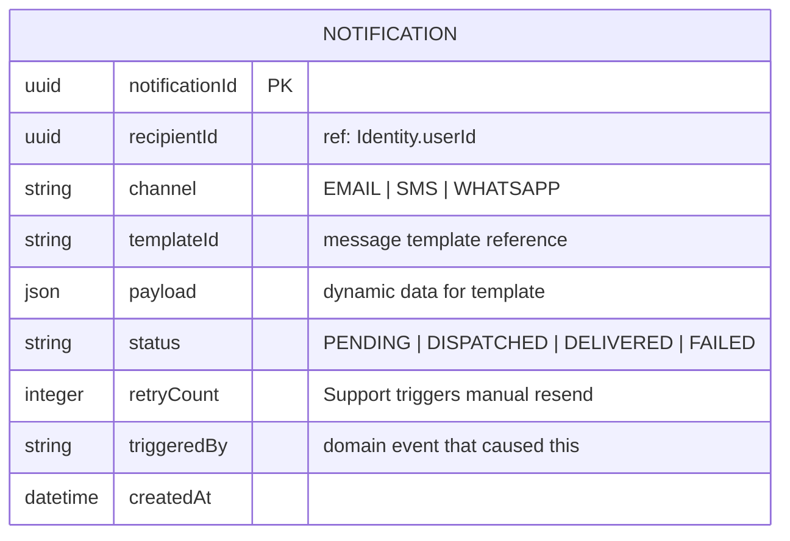

# ER Diagram — Notifications

> **Bounded Context:** Notifications  
> **Owned by:** Notifications Service  
> **Source:** `docs/phases/phase-1/aggregate-definitions.md`

> **Cross-service references:** `recipientId` → Identity. All by ID only. Notifications is a terminal service — no downstream consumers depend on its data.
