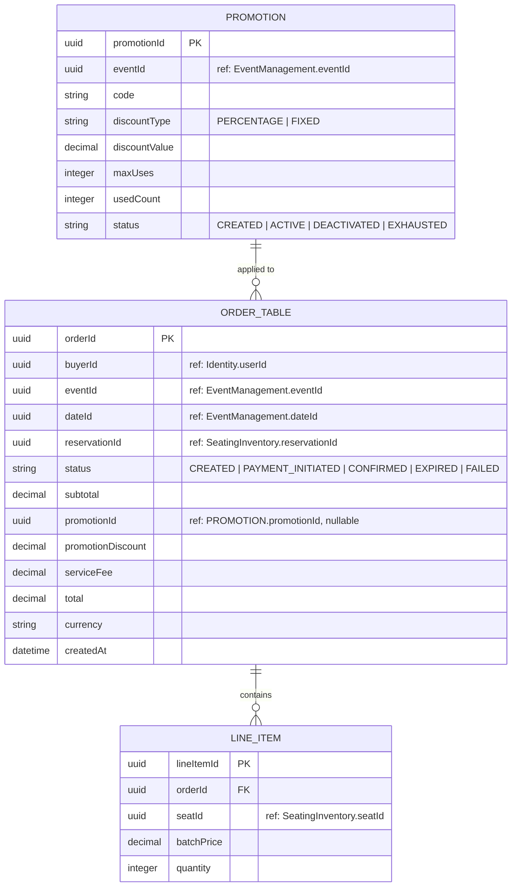

# ER Diagram — Orders

> **Bounded Context:** Orders  
> **Owned by:** Orders Service  
> **Source:** `docs/phases/phase-1/aggregate-definitions.md`  
> **Note:** Pricing (price resolution, Promotions) collapsed into Orders (ADR-011).

> **Cross-service references:** `buyerId` → Identity. `eventId`, `dateId` → Event Management. `reservationId` → Seating/Inventory. `seatId` → Seating/Inventory. All by ID only.
