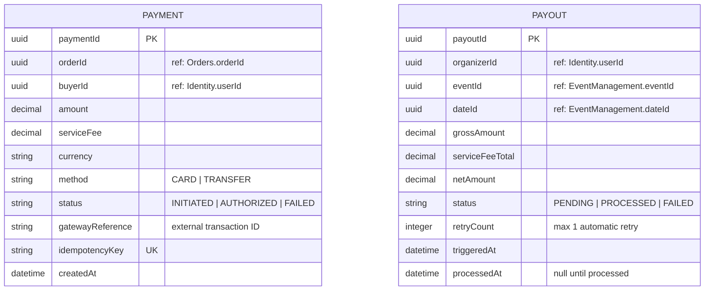

# ER Diagram — Payments

> **Bounded Context:** Payments  
> **Owned by:** Payments Service  
> **Source:** `docs/phases/phase-1/aggregate-definitions.md`

> **Cross-service references:** `orderId` → Orders. `buyerId`, `organizerId` → Identity. `eventId`, `dateId` → Event Management. All by ID only. No relationship between Payment and Payout at the DB level — Payout is generated asynchronously after the Date passes (ADR-009).
