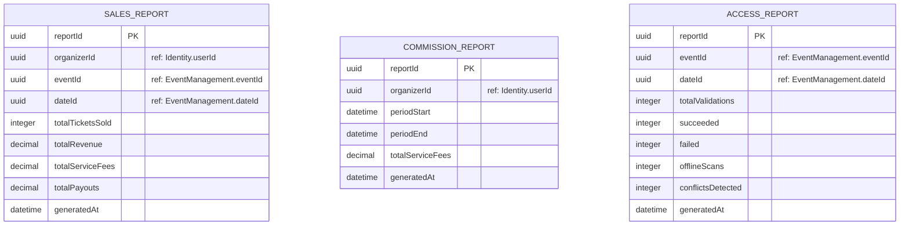

# ER Diagram — Reporting

> **Bounded Context:** Reporting  
> **Owned by:** Reporting Service  
> **Source:** `docs/phases/phase-1/aggregate-definitions.md`  
> **Note:** Reporting has no traditional aggregates — only read models (projections built from domain events).

> **Cross-service references:** `organizerId` → Identity. `eventId`, `dateId` → Event Management. All by ID only. Reports are eventually consistent projections — populated by consuming domain events (TicketIssued, PaymentAuthorized, PayoutProcessed, ValidationSucceeded, etc.). Reporting never queries other services' databases directly (discovery.md Block 11.2).
