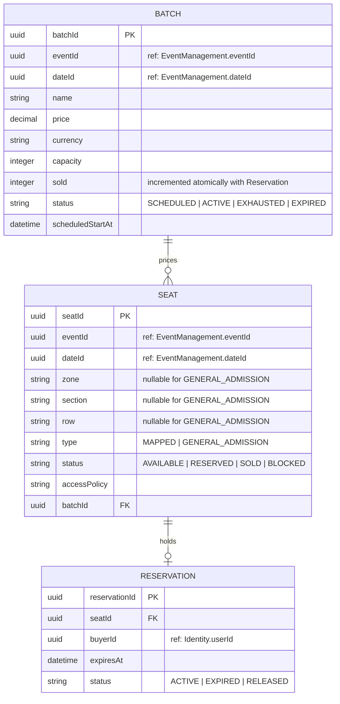

# ER Diagram — Seating / Inventory

> **Bounded Context:** Seating / Inventory  
> **Owned by:** Seating/Inventory Service  
> **Source:** `docs/phases/phase-1/aggregate-definitions.md`  
> **Note:** Batch is a child entity of the Seat aggregate (ADR-005). Reservation is a child entity of Seat.

> **Cross-service references:** `eventId`, `dateId` reference Event Management by ID. `buyerId` references Identity by ID. No foreign keys across service boundaries.
