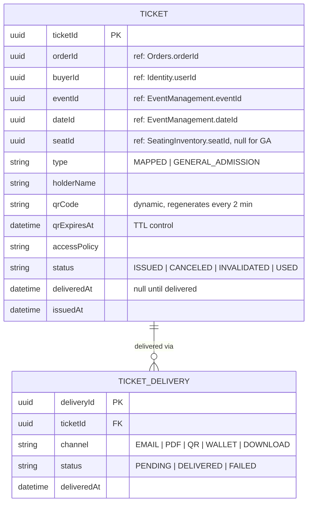

# ER Diagram — Ticket Issuance

> **Bounded Context:** Ticket Issuance  
> **Owned by:** Ticket Issuance Service  
> **Source:** `docs/phases/phase-1/aggregate-definitions.md`

> **Cross-service references:** `orderId` → Orders. `buyerId` → Identity. `eventId`, `dateId` → Event Management. `seatId` → Seating/Inventory. All by ID only. Access Control references `ticketId` one-way (ADR-013).
