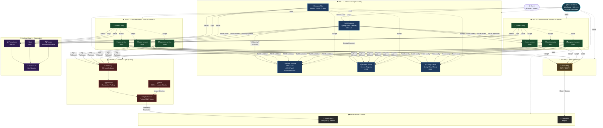

```mermaid
graph TB
    %% External
    CLIENT(["🌐 Client\n(Browser / Mobile)"])

    %% VPS 1 - Infrastructure
    subgraph VPS1["🖥️ VPS 1 — Infrastructure (Own VPS)"]
        GW["🚪 API Gateway\nSpring Cloud Gateway\n:80 / :443"]
        IS["🔐 Identity Service\nJWT Issuer\nJWKS /.well-known/jwks.json"]
        ES["📋 Eureka Server\nService Registry\n:8761"]
        CS["⚙️ Config Server\nSpring Cloud Config\n:8888"]
        ALLOY1["📡 Grafana Alloy\nMetrics · Logs · Traces"]
    end

    %% VPS 2 - Microservices Instance A
    subgraph VPS2["☁️ VPS 2 — Microservices A (GCP us-central1)"]
        OS_A["📦 order-service\n:8081"]
        US_A["👤 user-service\n:8082"]
        PS_A["💳 payment-service\n:8083"]
        ALLOY2["📡 Grafana Alloy"]
    end

    %% VPS 3 - Microservices Instance B
    subgraph VPS3["☁️ VPS 3 — Microservices B (AWS us-east-1)"]
        OS_B["📦 order-service\n:8081"]
        US_B["👤 user-service\n:8082"]
        PS_B["💳 payment-service\n:8083"]
        ALLOY3["📡 Grafana Alloy"]
    end

    %% VPS DB - Database
    subgraph VPSDB["🗄️ VPS DB — Database Layer (Cloud)"]
        HAPROXY["⚖️ HAProxy\nDB Load Balancer"]
        PGBOUNCER["🔄 pgBouncer\nConnection Pooling"]
        PATRONI_P["🐘 Spilo/Patroni\nPostgreSQL Primary"]
        ETCD["🗂️ etcd\nDCS — Leader Election"]
    end

    %% VPS MQ - Message Broker
    subgraph VPSMQ["📨 VPS MQ — Message Broker"]
        RABBIT["🐇 RabbitMQ\n:5672 / :15672"]
    end

    %% Local Server
    subgraph LOCAL["🏠 Local Server — Home"]
        PATRONI_R["🐘 Spilo/Patroni\nPostgreSQL Replica"]
        RABBIT_R["🐇 RabbitMQ\nReplica"]
    end

    %% Grafana Cloud
    subgraph GRAFANA["☁️ Grafana Cloud — Observability"]
        PROM["📊 Prometheus\nMetrics"]
        LOKI["📜 Loki\nLogs"]
        TEMPO["🔍 Tempo\nDistributed Tracing"]
        GRAF_UI["📈 Grafana UI\nDashboards"]
    end

    %% ── Tailscale Mesh note ──
    TAILSCALE(["🔒 Tailscale Mesh\nWireGuard · 100.x.x.x\nAll nodes connected"])

    %% ── Connections ──

    %% Client to Gateway
    CLIENT -->|"HTTPS :443"| GW

    %% Gateway resolves via Eureka, validates JWT
    GW -->|"Service Discovery"| ES
    GW -->|"Validate JWT\n(JWKS)"| IS
    GW -->|"Route /orders"| OS_A
    GW -->|"Route /orders"| OS_B
    GW -->|"Route /users"| US_A
    GW -->|"Route /users"| US_B
    GW -->|"Route /payments"| PS_A
    GW -->|"Route /payments"| PS_B

    %% Services register to Eureka
    OS_A & US_A & PS_A -->|"Register\n100.x.x.2"| ES
    OS_B & US_B & PS_B -->|"Register\n100.x.x.3"| ES

    %% Services fetch config
    OS_A & US_A & PS_A & OS_B & US_B & PS_B -->|"Fetch config"| CS

    %% Services validate JWT via JWKS
    OS_A & US_A & PS_A & OS_B & US_B & PS_B -->|"JWKS validation"| IS

    %% Services to DB
    OS_A & US_A & PS_A & OS_B & US_B & PS_B -->|"SQL\n(Tailscale)"| HAPROXY
    HAPROXY --> PGBOUNCER
    PGBOUNCER --> PATRONI_P
    PATRONI_P -->|"Streaming\nReplication"| PATRONI_R
    ETCD -->|"Leader Election"| PATRONI_P

    %% Services to RabbitMQ
    OS_A & PS_A & OS_B & PS_B -->|"AMQP"| RABBIT
    RABBIT -->|"Mirror / Replica"| RABBIT_R

    %% Observability
    ALLOY1 & ALLOY2 & ALLOY3 -->|"Metrics"| PROM
    ALLOY1 & ALLOY2 & ALLOY3 -->|"Logs"| LOKI
    ALLOY1 & ALLOY2 & ALLOY3 -->|"Traces"| TEMPO
    PROM & LOKI & TEMPO --> GRAF_UI

    %% Alloy collects from local services
    ALLOY1 -.->|"scrape"| GW & IS & ES & CS
    ALLOY2 -.->|"scrape"| OS_A & US_A & PS_A
    ALLOY3 -.->|"scrape"| OS_B & US_B & PS_B

    %% Tailscale connects everything
    TAILSCALE -.->|"mesh"| VPS1
    TAILSCALE -.->|"mesh"| VPS2
    TAILSCALE -.->|"mesh"| VPS3
    TAILSCALE -.->|"mesh"| VPSDB
    TAILSCALE -.->|"mesh"| VPSMQ
    TAILSCALE -.->|"mesh"| LOCAL

    %% Styles
    classDef infra fill:#1e3a5f,stroke:#4a90d9,color:#e8f4fd
    classDef microservice fill:#1a4a2e,stroke:#4caf7d,color:#e8f5e9
    classDef db fill:#4a1e1e,stroke:#e57373,color:#fde8e8
    classDef mq fill:#4a3a1e,stroke:#ffb74d,color:#fff3e0
    classDef obs fill:#2d1b4e,stroke:#9c6fe4,color:#f3e8ff
    classDef network fill:#1a3a4a,stroke:#4dd0e1,color:#e0f7fa
    classDef local fill:#2a2a2a,stroke:#888,color:#eee

    class GW,IS,ES,CS,ALLOY1 infra
    class OS_A,US_A,PS_A,ALLOY2,OS_B,US_B,PS_B,ALLOY3 microservice
    class HAPROXY,PGBOUNCER,PATRONI_P,ETCD db
    class PATRONI_R,RABBIT_R local
    class RABBIT mq
    class PROM,LOKI,TEMPO,GRAF_UI obs
    class TAILSCALE network
```